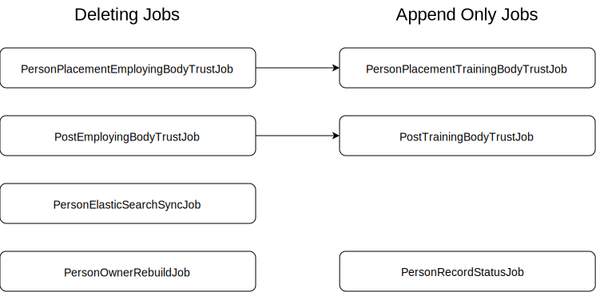

# TIS-SYNC

This Service takes the current cron jobs from the TCS service, running them from this service instead.

For more description, see [Confluence Sync Service Description](https://hee-tis.atlassian.net/wiki/spaces/NTCS/pages/1263271954/Sync+Service)

## Pre-requisites
The following environmental variables must be provided
 - `AWS_ACCESS_KEY_ID`
 - `AWS_SECRET_ACCESS_KEY`
 - `AWS_REGION`

## Run jobs out of schedule

### Job Execution Order


### Summary of what to run:

| Failed/Out-of-date Job                   |          Managed Bean Name          |                            Method Name |                           Things that need to be done after this has been started |
|------------------------------------------|:-----------------------------------:|---------------------------------------:|----------------------------------------------------------------------------------:|
| **PersonOwnerRebuildJob**                |        PersonOwnerRebuildJob        |                  personOwnerRebuildJob |                        **PersonElasticSearchSyncJob** (assuming only this failed) |
| **PersonPlacementEmployingBodyTrustJob** |   PersonPlacementEmployingBodyJob   | doPersonPlacementEmployingBodyFullSync | Re-run **PersonPlacementTrainingBodyTrustJob** and **PersonElasticSearchSyncJob** |
| **PersonPlacementTrainingBodyTrustJob**  | PersonPlacementTrainingBodyTrustJob |    PersonPlacementTrainingBodyFullSync |                        **PersonElasticSearchSyncJob** (assuming only this failed) |
| **PostEmployingBodyTrustJob**            |      PostEmployingBodyTrustJob      |         PostEmployingBodyTrustFullSync |                                               Re-run **PostTrainingBodyTrustJob** |
| **PostTrainingBodyTrustJob**             |      PostTrainingBodyTrustJob       |          PostTrainingBodyTrustFullSync |                                                  none (assuming only this failed) |
| **PersonRecordStatusJob**                |        PersonRecordStatusJob        |                  personRecordStatusJob |                        **PersonElasticSearchSyncJob** (assuming only this failed) |
| **PersonElasticSearchSyncJob**           |       PersonElasticSearchJob        |                personElasticSearchSync |                                                                              none |
| **PostFundingStatusSyncJob**             |      PostFundingStatusSyncJob       |         postFundingStatusSyncJob       |                                              Re-run **Post Funding Status Sync Job** |

### Run jobs on Buttons Page
1. If you want to run jobs on server, go to page https://\<host IP here\>/sync/.
2. Click **Get Status** to view statuses of all the jobs. If can't get any response from the page, please refer to [permission to run jobs on the page](#permission)
3. Then click **Run job** buttons or **Run All Jobs** button to trigger the jobs you want.
#### <span id="permission">Permission to run jobs on the page:</span>
1. "Machine User" role is used to view the statuses and click the buttons. If you don't have this role, you won't get any response after clicking any buttons.<br>
2. "Machine User" role is hidden in **UserManagement** page, so need to add this role to the database you need on the fly.<br>
3. SQL to add "Machine User" Role:
```
INSERT INTO UserRole(userName, roleName) 
VALUES (YOUR_USER_NAME, "Machine User");
```
#### Run PersonRecordStatusJob with argument
When clicking the button to run Person Record Status Sync job, a dialog box will be displayed to prompt the user for input an argument.<br />
You can input one of the following arguments(case-insensitive):
1. keep it blank: repeat the overnight job
2. ANY: update all records
3. date in format YYYY-MM-DD: update for a particular date
4. NONE: use the parameter "dateOfChangeOverride" in the application.yml which can be set via environment variable(e.g. AWS parameter store)
