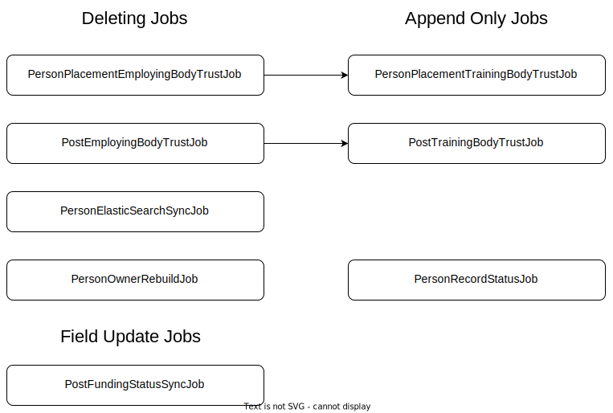

# TIS-SYNC

This Service takes the current cron jobs from the TCS service, running them from this service instead.

Also see [Confluence Sync Service Description](https://hee-tis.atlassian.net/wiki/spaces/NTCS/pages/1263271954/Sync+Service)

## Run jobs out of schedule

### Job Execution Order


### Summary of what to run:

| Failed/Out-of-date Job                   |          Managed Bean Name          |                            Method Name |                           Things that need to be done after this has been started |
| ---------------------------------------- | :---------------------------------: | -------------------------------------: | --------------------------------------------------------------------------------: |
| **PersonOwnerRebuildJob**                |        PersonOwnerRebuildJob        |                  personOwnerRebuildJob |                                                                              none |
| **PersonPlacementEmployingBodyTrustJob** |   PersonPlacementEmployingBodyJob   | doPersonPlacementEmployingBodyFullSync | Re-run **PersonPlacementTrainingBodyTrustJob** and **PersonElasticSearchSyncJob** |
| **PersonPlacementTrainingBodyTrustJob**  | PersonPlacementTrainingBodyTrustJob |    PersonPlacementTrainingBodyFullSync |                        **PersonElasticSearchSyncJob** (assuming only this failed) |
| **PostEmployingBodyTrustJob**            |      PostEmployingBodyTrustJob      |         PostEmployingBodyTrustFullSync |                                               Re-run **PostTrainingBodyTrustJob** |
| **PostTrainingBodyTrustJob**             |      PostTrainingBodyTrustJob       |          PostTrainingBodyTrustFullSync |                                                  none (assuming only this failed) |
| **PersonElasticSearchSyncJob**           |       PersonElasticSearchJob        |                personElasticSearchSync |                                                                              none |

### Run jobs directly on server
If a job needs to be run manually, e.g. after a database has been re-imported to stage:

1. Copy the commands below into your favorite text editor.
2. Replace the $bean_name and $job_method with the ones for the job you are re-running.
3. ssh into green server and paste the modified commands in a single chunk and it will go through the process of:
   - downloading the JDK and the JMX client
   - copy them to the container
   - extract the compressed JDK
   - launch the JMX client and
   - restart the sync job.

N.B. Refer to the "Job Execution Order" above to see whether there is an appending Job which needs to be run afterward.

```
cd /tmp
mkdir javatools
cd javatools
wget https://heetisrequiredapps.blob.core.windows.net/javafiles/jmxterm-1.0.0-uber.jar
wget https://heetisrequiredapps.blob.core.windows.net/javafiles/jdk-8-linux-x64.tar.gz
cd ..
docker cp javatools sync_sync_1:/tmp
docker exec -it sync_sync_1 /bin/bash
cd /tmp/javatools
tar -zxvf jdk-8-linux-x64.tar.gz
rm jdk-8-linux-x64.tar.gz
./jdk1.8.0_202/bin/java -jar jmxterm-1.0.0-uber.jar
open 1
domain sync.mbean
bean sync.mbean:name=$bean_name
run $job_method
run isCurrentlyRunning
exit
```
When you're back at the **bash-4.4#** prompt you can run the following command to keep an eye on the progress of the sync.

`tail /var/log/apps/sync.log -f`

### Run jobs on Buttons Page
1. If you want to run jobs on **Dev**, go to page https://dev-apps.tis.nhs.uk/sync/(need to log in using Tis username & password).
2. Click **Get Status** to view statuses of all the jobs. If can't get any response from the page, please refer to [permission to run jobs on the page](#permission)
3. Then click **Run job** buttons or **Run All Jobs** button to trigger the jobs you want.
#### <span id="permission">Permission to run jobs on the page:</span>
1. "Machine User" role is used to view the statuses and click the buttons. If you don't have this role, you won't get any response after clicking any buttons.<br>
2. "Machine User" role is hidden in **UserManagement** page, so need to add this role to the database you need on the fly.<br>
3. SQL to add "Machine User" Role:
```
INSERT INTO UserRole(userName, roleName) 
VALUES (yourUserName, "Machine User");
```